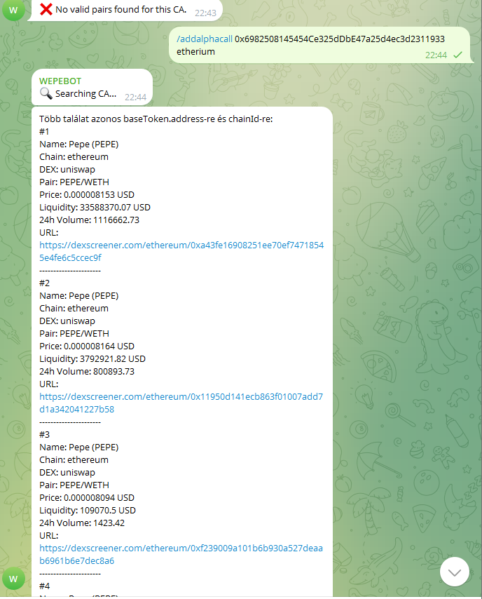
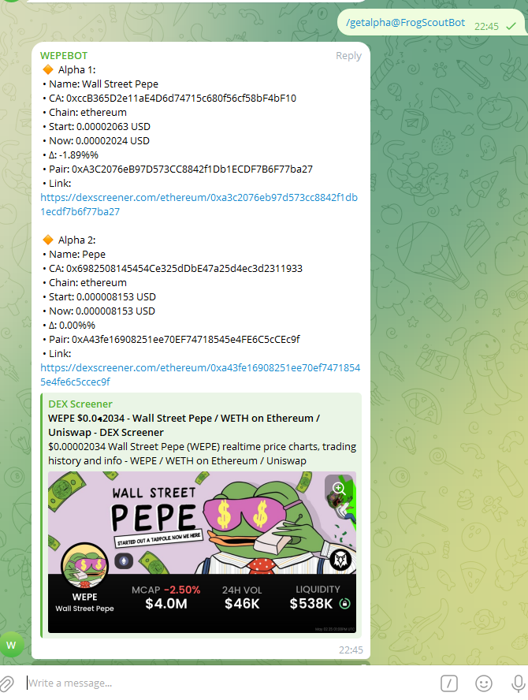

# TelegramBot

**Real-time “alpha call” tracker, built in F#.**

WepeBot is a Telegram bot that automates tracking of new token listings (“alpha calls”), fetching live price data from Dexscreener and surfacing percentage changes directly in your group chat. It was created to save manual lookups and give the Wepe alpha group instant alerts. Once the exam period is over, I will collaborate with another developer to extend its features even further.

---

## Live Demo

Join our public Telegram group to see WepeBot in action (admin rights required):
👉 [https://t.me/+Cw26psLlUx84ODE8](https://t.me/+Cw26psLlUx84ODE8)

> ⚠️ **Note:** Bot commands require admin privileges. As soon as you join, send me a message and I’ll grant you the rights needed to interact.

---

## Features

* **Add New Alpha Calls**
  Extracts contract address and chain automatically via OpenAI API.
* **Live Price Updates**
  Queries Dexscreener for up to 300 requests per minute.
* **List & Stats**
  Shows current vs. start price and Δ% change.
* **Remove & Edit**
  `/removecall <index>` and `/changestart <index> <price>`.
* **Automated Loop**
  `/start` begins periodic postings; `/interval <minutes>` adjusts frequency; `/stop` ends the loop.
* **Admin-Only Access**
  Only group admins can manage calls.
* **Persistence**
  Saves state in `state.json` and reloads on startup.
  


---

## Commands & Usage

> **All commands must be issued by a Telegram group admin.**

| Command                        | Description                                                                  |
| ------------------------------ | ---------------------------------------------------------------------------- |
| `/addalphacall <description>`  | Extracts CA & chain, fetches token info, and adds a new alpha call.          |
| `/getalpha`                    | Lists all tracked calls with live price, start price, and percentage change. |
| `/removecall <index>`          | Removes the alpha call at the given index.                                   |
| `/changestart <index> <price>` | Updates the start price for the specified call.                              |
| `/start`                       | Starts the periodic update loop.                                             |
| `/interval <minutes>`          | Sets loop interval in minutes.                                               |
| `/stop`                        | Stops the periodic update loop.                                              |

---

## How It Works

1. **/addalphacall**

   * Sends your description to OpenAI to extract the contract address (CA) and chain name.
   * Queries Dexscreener for token metadata and price, then stores the call.
2. **/getalpha**

   * Fetches the latest price for each saved call, calculates Δ%, and posts results.
3. **/removecall & /changestart**

   * Manage your saved calls by index.
4. **Periodic Updates**

   * `/start` and `/interval` spin up a background loop that posts updates to the chat every *n* minutes.
5. **State Persistence**

   * Calls are serialized to `state.json` on disk and reloaded on bot startup.

---

## Setup

### Prerequisites

* [.NET 7 SDK](https://dotnet.microsoft.com/download) or newer
* FSharp.Core (included via NuGet)
* Telegram Bot token
* OpenAI API key

### Local Build & Run

```bash
git clone https://github.com/your-org/WepeBot.git
cd WepeBot
dotnet build
dotnet run
```

---

## Project Structure

```bash
WepeBot/
├─ Program.fs          # Main entry point with all handlers
├─ WepeBot.fsproj      # F# project file
├─ state.json          # Saved alpha calls
├─ screenshots/        # Screenshots for README
└─ README.md           # Project documentation
```

---

## Dependencies

* Telegram.Bot
* System.Net.Http
* System.Text.Json
* FSharp.Control.Tasks.V2.ContextInsensitive

---

## Roadmap

* Multi-chat support
* Web dashboard with historical charts
* Richer analytics & alerts
* Post-exam collaboration with another developer

---

## Contributing

1. Fork the repo
2. Create a feature branch (`git checkout -b feature/xyz`)
3. Commit your changes (`git commit -m "Add xyz"`)
4. Push to your branch (`git push origin feature/xyz`)
5. Open a Pull Request

---

## License

This project is licensed under the MIT License.
